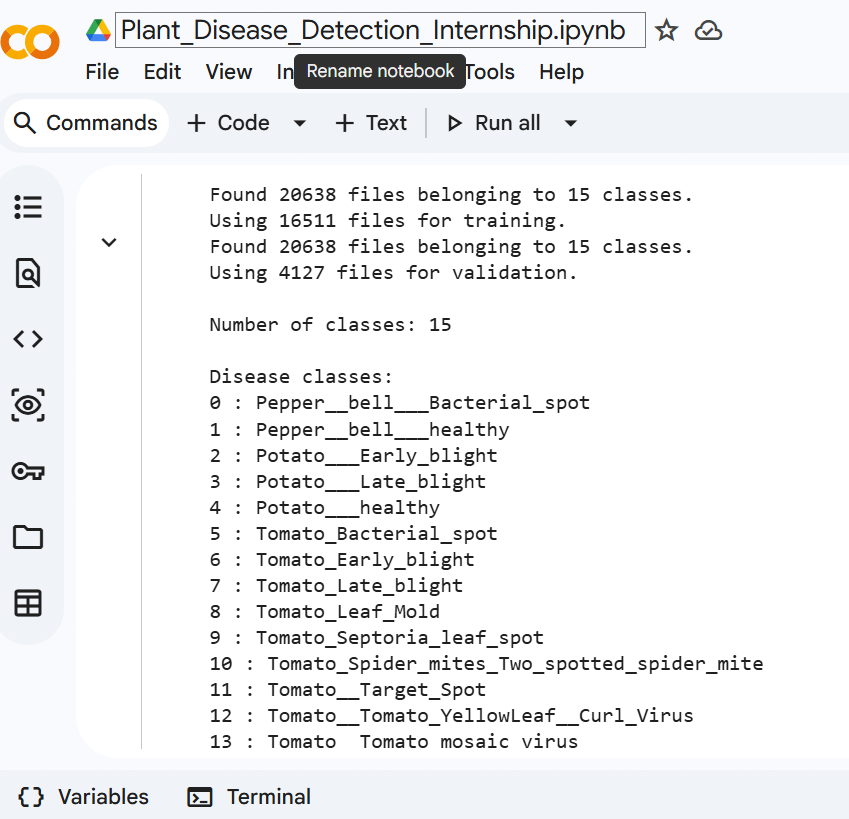
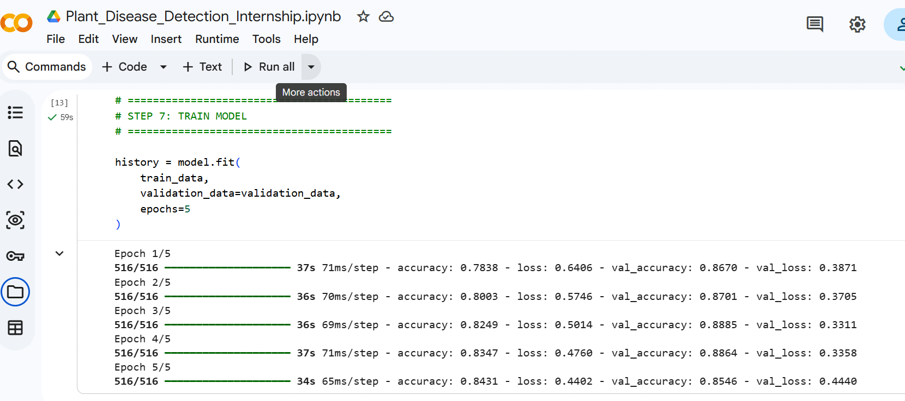
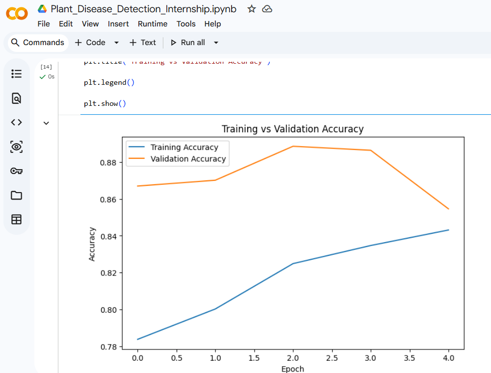
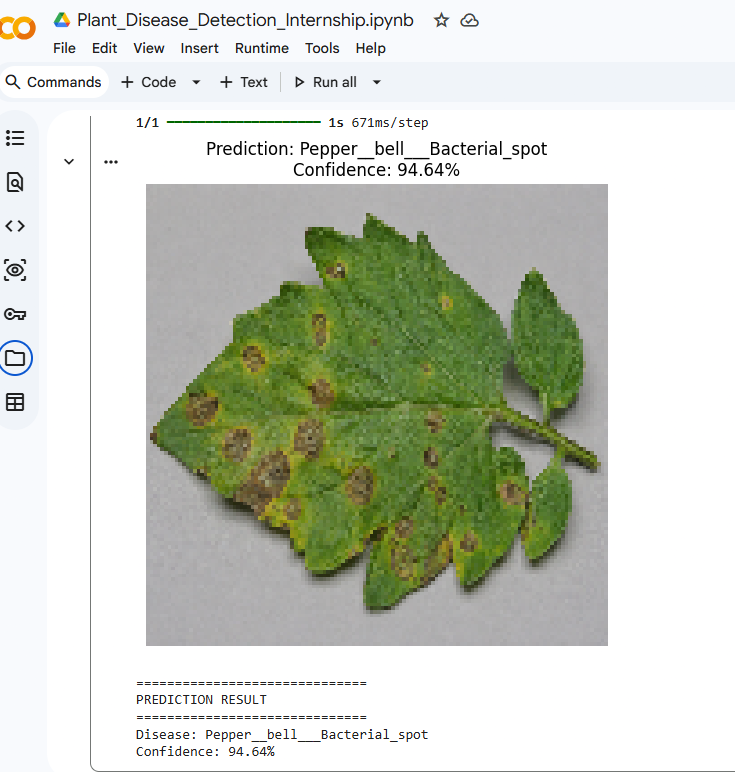

# 🌱 Plant Disease Detection Using CNN

## Internship Project

### Intern Details

| Details | Information |
|---|---|
| Intern ID | CITS7184 |
| Full Name | KEERTHI GORLA |
| Number of Weeks | 4 Weeks |
| Project Name | Plant Disease Detection |
| Project Type | Deep Learning / Computer Vision |

---

## 📌 Project Scope

The objective of this project is to develop a deep learning-based system that can identify plant diseases from leaf images.

The system takes a plant leaf image as input and predicts the corresponding disease using a Convolutional Neural Network (CNN).

The project includes:

- Plant leaf image classification
- Image preprocessing
- CNN model development
- Model training
- Model validation
- Model evaluation
- Disease prediction from a new image

---

## 📝 Project Description

Plant diseases can negatively affect crop quality and agricultural production. Early identification of diseases can help in taking appropriate action.

This project uses the PlantVillage dataset to train a CNN model for classifying plant leaf images into different disease categories.

The trained model analyzes a new leaf image and predicts the plant disease along with a confidence score.

---

## 📊 Dataset

The project uses the PlantVillage dataset.

### Dataset Information

- Total Images: 20,638
- Number of Classes: 15
- Training Images: 16,511
- Validation Images: 4,127

### Plants Included

- Pepper
- Potato
- Tomato

### Disease Classes

1. Pepper Bell Bacterial Spot
2. Pepper Bell Healthy
3. Potato Early Blight
4. Potato Late Blight
5. Potato Healthy
6. Tomato Bacterial Spot
7. Tomato Early Blight
8. Tomato Late Blight
9. Tomato Leaf Mold
10. Tomato Septoria Leaf Spot
11. Tomato Spider Mites
12. Tomato Target Spot
13. Tomato Yellow Leaf Curl Virus
14. Tomato Mosaic Virus
15. Tomato Healthy

---

## 🛠️ Technologies Used

- Python
- TensorFlow
- Keras
- NumPy
- Matplotlib
- Scikit-learn
- Pillow
- Seaborn
- Google Colab
- GitHub

---

## 🧠 Model

A Convolutional Neural Network (CNN) was developed for plant disease classification.
### Model Architecture

Input Image
↓
Rescaling
↓
Convolutional Layer
↓
Max Pooling
↓
Convolutional Layer
↓
Max Pooling
↓
Convolutional Layer
↓
Max Pooling
↓
Flatten
↓
Dense Layer
↓
Dropout
↓
Output Layer
↓
15 Classes

### Project Workflow

Plant Leaf Image
↓
Image Preprocessing
↓
Dataset Loading
↓
CNN Model
↓
Model Training
↓
Model Validation
↓
Model Evaluation
↓
New Leaf Image
↓
Disease Prediction

---

## 📈 Model Training

The CNN model was trained using the PlantVillage dataset.

Training was performed for 5 epochs using:

- Adam optimizer
- Sparse Categorical Crossentropy loss
- Accuracy as the evaluation metric

Training and validation performance were visualized using accuracy and loss graphs.

---

## 🔍 Sample Prediction

The trained model was tested using a new plant leaf image.

### Result

**Predicted Disease:** Pepper Bell Bacterial Spot

**Confidence:** 94.64%

The model successfully classified the sample image as Pepper Bell Bacterial Spot with a confidence score of 94.64%.

---

## 📷 Screenshots

### Dataset

### Training

### Accuracy Graph

### Prediction

---

## 📁 Project Structure

Plant-Disease-Detection/
│
├── README.md
├── Plant_Disease_Detection.ipynb
├── requirements.txt
├── dataset.png
├── training.png
├── accuracy.png
└── prediction.png

---

## 💻 Source Code

The complete source code is available in:

**Plant_Disease_Detection.ipynb**

The notebook contains:

- Dataset loading
- Data preprocessing
- CNN model creation
- Model training
- Model evaluation
- Accuracy and loss visualization
- Plant disease prediction

---

## ▶️ How to Run the Project

1. Open the `Plant_Disease_Detection.ipynb` notebook in Google Colab.

2. Connect Google Drive to access the PlantVillage dataset.

3. Install the required Python libraries.

4. Run the notebook cells in order.

5. Upload a plant leaf image for testing.

6. The model will display the predicted disease and confidence score.

### Example Output

Disease: Pepper__bell___Bacterial_spot

Confidence: 94.64%

---

## 📚 Documentation

This project demonstrates the use of a Convolutional Neural Network (CNN) for detecting plant diseases from leaf images.

The complete implementation includes:

* Dataset loading
* Image preprocessing
* CNN model creation
* Model training
* Model validation
* Model evaluation
* Accuracy and loss visualization
* Plant disease prediction

The model is trained using the PlantVillage dataset and classifies plant leaf images into 15 different categories.

---

## 🚀 Future Improvements

* Use a larger and more diverse dataset
* Apply data augmentation
* Use advanced CNN models such as ResNet, MobileNet, or EfficientNet
* Improve prediction accuracy
* Develop a web or mobile application
* Add disease treatment recommendations

---

## 👩‍💻 Author

**KEERTHI GORLA**

B.Tech in Artificial Intelligence

Vidya Jyothi Institute of Technology

---

## 📌 Project Status

**Completed ✅**

This project was developed as part of a 4-week internship project in Deep Learning and Computer Vision.
